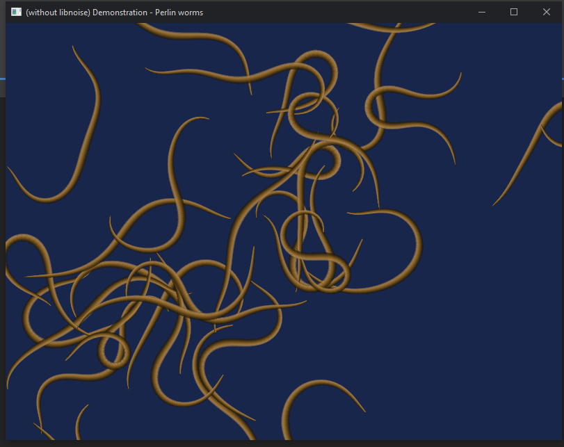

# Perlin-worms java
Port of libnoise <a href="https://libnoise.sourceforge.net/examples/worms/">"Perlin Worms" example</a>

Using Joml, FastNoiseLite, LWJGL3+, GLFW, and GLU for create texture with MipMaps

Animated Gif

